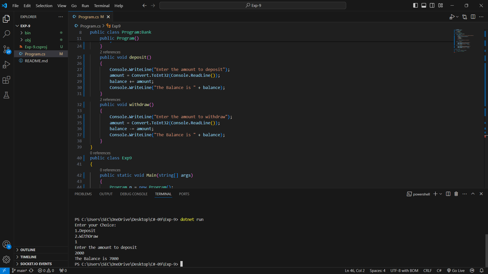

# 19AI308-Object-Oriented-Programming-using-CSharp-Exp-9---Interface-with-abstract-methods

# AIM:
To develop a small bank application by declaring deposit() and withdrawal() as an abstract methods in the interface. 

# PROGRAM:
```
using System;
using System.Transactions;
public interface Bank
{
    void deposit();
    void withdraw();
}
public class Program:Bank
{
    public int amount,balance=5000;
    public Program()
    {
        Console.WriteLine("Enter your Choice:\n1.Deposit\n2.WithDraw");
        int opt;
        opt = Convert.ToInt32(Console.ReadLine());
        if (opt == 1)
            deposit();
        else if (opt == 2)
            withdraw();
        else
        {
            Console.WriteLine("Enter a valid input");
        }
    }
    public void deposit()
    {
        Console.WriteLine("Enter the amount to deposit");
        amount = Convert.ToInt32(Console.ReadLine());
        balance += amount;
        Console.WriteLine("The Balance is " + balance);
    }
    public void withdraw()
    {
        Console.WriteLine("Enter the amount to withdraw");
        amount = Convert.ToInt32(Console.ReadLine());
        balance -= amount;
        Console.WriteLine("The Balance is " + balance);
    }
}
public class Exp9
{
    public static void Main(string[] args)
    {
        Program n = new Program();
    }
}
```
# OUTPUT:

# RESULT:
Thus, a C# program has created for developing a small bank application by declaring deposit() and withdraw() as an abstract methods in the interface and it is executed and verified successfully.
